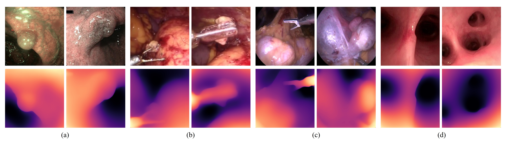

# EndoOmni

This repository provides the code for the paper "[EndoOmni: Zero-Shot Cross-Dataset Depth Estimation in Endoscopy by Robust Self-Learning from Noisy Labels](https://arxiv.org/abs/2409.05442)".



## Table of Contents
- [Results](#results)
- [Dataset Download](#dataset-download)
- [Environment Setup](#environment-setup)
- [Pretrained Weights](#pretrained-weights)
- [Running Evaluation](#running-evaluation)
- [Citing the Paper](#citing-the-paper)
- [Acknowledgement](#acknowledgement)
- [Future Updates](#future-updates)

## Results

### Zero-shot RDE on Hamlyn Dataset
| **Method**                       | **AbsRel↓** | **SqRel↓** | **RMSE↓** | **RMSElog↓** | **δ1↑** |
|----------------------------------|-------------|------------|-----------|--------------|----------|
| **EDM**   | 0.185       | 5.424      | 16.100    | 0.255        | 0.732    |
| **AF-SfMLearner**  | 0.168 | 4.440 | 13.870 | 0.204 | 0.770 |
| **Surgical-DINO**  | 0.146 | 3.216 | 11.974 | 0.178 | 0.801 |
| **EndoDAC**     | 0.138       | 2.796      | 11.491    | 0.171        | 0.813    |
| **IID-SfmLearner**  | 0.157 | 2.995 | 11.621 | 0.192 | 0.776 |
| **DepthAnything-L**  | 0.174  | 3.829      | 13.226    | 0.210        | 0.750    |
| **DepthAnything2-L**  | 0.229 | 5.949      | 16.718    | 0.269        | 0.649    |
| **Ours**                          | **0.125**   | **2.337**  | **10.858**| **0.160**    | **0.827**|

### Zero-shot RDE on SERV-CT
| **Method**                       | **AbsRel↓** | **SqRel↓** | **RMSE↓** | **RMSElog↓** | **δ1↑** |
|----------------------------------|-------------|------------|-----------|--------------|----------|
| **SfMLearner**  | 0.151      | 3.917      | 17.451    | 0.191        | 0.779    |
| **Fang et al.**  | 0.149      | 3.099      | 15.564    | 0.188        | 0.787    |
| **DeFeat-Net**  | 0.114     | 1.946      | 12.588    | 0.153        | 0.873    |
| **SC-SfMLearner**  | 0.117     | 2.015      | 12.415    | 0.148        | 0.852    |
| **Monodepth2**  | 0.123     | 2.205      | 12.927    | 0.152        | 0.856    |
| **Endo-SfM**   | 0.116     | 2.014      | 12.493    | 0.143        | 0.864    |
| **AF-SfMLearner**  | 0.102     | 1.632      | 11.092    | 0.131        | 0.898    |
| **IID-SfmLearner**  | 0.123 | 1.870 | 10.985 | 0.153 | 0.833 |
| **MonoPCC**  | 0.091 | 1.252 | 10.059 | 0.116 | 0.915 |
| **EndoDAC**  | 0.079 | 0.983 | 8.723 | 0.103 | 0.945 |
| **DepthAnything-L**  | 0.080   | 0.906      | 7.212     | 0.098        | 0.928    |
| **DepthAnything2-L**  | 0.130  | 2.125      | 10.578    | 0.160        | 0.818    |
| **Ours**                          | **0.053**   | **0.432**  | **5.922** | **0.070**    | **0.988**|

*Note*: **Best** performances are highlighted. All recovered scale before evaluation. Used EndoOmni with ViT-B backbone for this experiment.

## Dataset Download
To download the datasets used in this project:

1. Visit the official websites for the datasets. Some datasets require a formal request to the dataset owners or challenge organizers.
   - **SERV-CT**: [Download Link](https://www.ucl.ac.uk/interventional-surgical-sciences/weiss-open-research/weiss-open-data-server/serv-ct)
   - **Hamlyn**: [Download Link](https://unizares-my.sharepoint.com/personal/recasens_unizar_es/_layouts/15/onedrive.aspx?id=%2Fpersonal%2Frecasens%5Funizar%5Fes%2FDocuments%2FDoctorado%2FEndo%2DDepth%2Dand%2DMotion%2FOpen%20access%20files%2Fhamlyn%5Fdata&ga=1)
   - **SCARED**: [Download Link](https://endovissub2019-scared.grand-challenge.org/)
   - **C3VD**: [Download Link](https://durrlab.github.io/C3VD/)
   - **EndoAbS**: [Download Link](https://zenodo.org/records/60593)
   - **SimColon**: [Download Link](http://cmic.cs.ucl.ac.uk/ColonoscopyDepth)
   - **EndoSLAM**: [Download Link](https://data.mendeley.com/datasets/cd2rtzm23r/1)
   - **EndoMapper**: [Download Link](https://www.synapse.org/#!Synapse:syn52137895)
   - **EAD**: [Download Link](https://data.mendeley.com/datasets/c7fjbxcgj9/2)
   - **CholecT50**: [Download Link](https://github.com/CAMMA-public/cholect50/tree/master)
   - **Surgical-Vis**: [Download Link](https://www.synapse.org/surgvisdom2020)
   - **CVC-ClinicDB**: [Download Link](https://polyp.grand-challenge.org/CVCClinicDB/)
   - **ROBUST-MIS**: [Download Link](https://www.synapse.org/Synapse:syn18779624/wiki/591266)

2. Download the datasets and extract them into a directory. Make sure to note the paths where they are stored.

3. Update the dataset root paths in `/util/Mix_Dataloader`. For example:
    ```python
    DATASETS_CONFIG = {
        "SERV-CT": {
            "dataset": "SERV-CT",
            "root": "/path/to/dataset/root"
        },
        ...
    }
    ```

## Environment Setup
To set up the Python environment:

1. Clone this repository:
    ```bash
    git clone https://github.com/TianCuteQY/EndoOmni.git
    cd EndoOmni
    ```

2. This code has been tested with the following environment:
    ```text
    Python version: 3.9.19
    PyTorch version: 2.3.1+cu121
    PyTorch CUDA version: 12.1
    Torchvision version: 0.18.1+cu121
    NumPy version: 1.26.4
    ```

## Pretrained Weights
To download the pretrained model weights:

1. Download the pretrained weights from the following links:
   - **EndoOmni as initialization for finetuning (Scale and Shift Ambiguous Depth Estimation)**: [OneDrive](https://1drv.ms/f/c/a1665b05a1f6eb8c/ElFQzcEHcWJLpF7s4EnZFdwB8Bt9V7hGKPMqEQWA18ECog?e=lwfvtI)
   - **EndoOmni for comparison with existing methods (Scale Ambiguous Depth Estimation)**: [OneDrive](https://1drv.ms/f/c/a1665b05a1f6eb8c/ErMI4XR-R8tHjmeLchOMQgEBrHjXaab6R_fbTfjs4d2NMA?e=ZyHHY6)

2. Place the downloaded weights in a directory and note the paths.

## Running Evaluation
To evaluate the model on a specified dataset, run the evaluation script:

```bash
python evaluate.py --config config.json --model_weights /path/to/weights.pth --dataset dataset_name --backbone vitb --scaling median
```

Replace /path/to/weights.pth and dataset_name with the appropriate model weights path and dataset name. You should use our scale ambiguous version weights for median scaling evaluation.

This will use median scaling for depth evaluation. The results and metrics will be displayed in the terminal upon completion.

## Citing the Paper
If you find this work useful in your research, please cite our paper:
```bibtex
@article{tian2024endoomni,
  title={EndoOmni: Zero-Shot Cross-Dataset Depth Estimation in Endoscopy by Robust Self-Learning from Noisy Labels},
  author={Tian, Qingyao and Chen, Zhen and Liao, Huai and Huang, Xinyan and Li, Lujie and Ourselin, Sebastien and Liu, Hongbin},
  journal={arXiv preprint arXiv:2409.05442},
  year={2024}
}
```

## Acknowledgement
This code is based on [Depth Anything](https://github.com/LiheYoung/Depth-Anything), [ZoeDepth](https://github.com/isl-org/ZoeDepth) and [EndoDAC](https://github.com/BeileiCui/EndoDAC). Thanks for their exellent work!

## Future Updates
The training code will be released after the paper is accepted. If you have any questions or suggestions, please feel free to contact us at tianqingyao2021@ia.ac.cn. We would be happy to help! 😊


